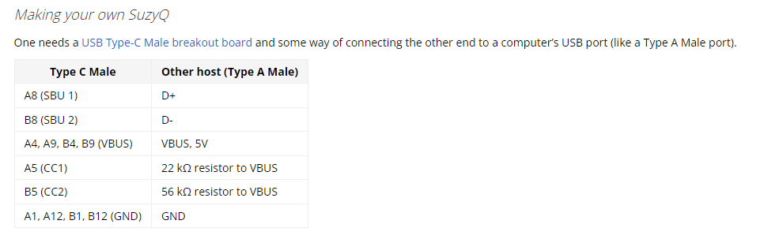
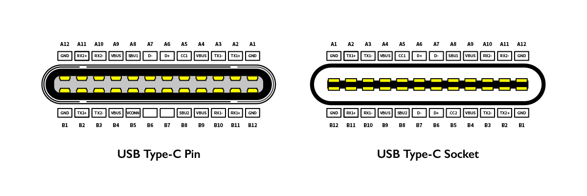
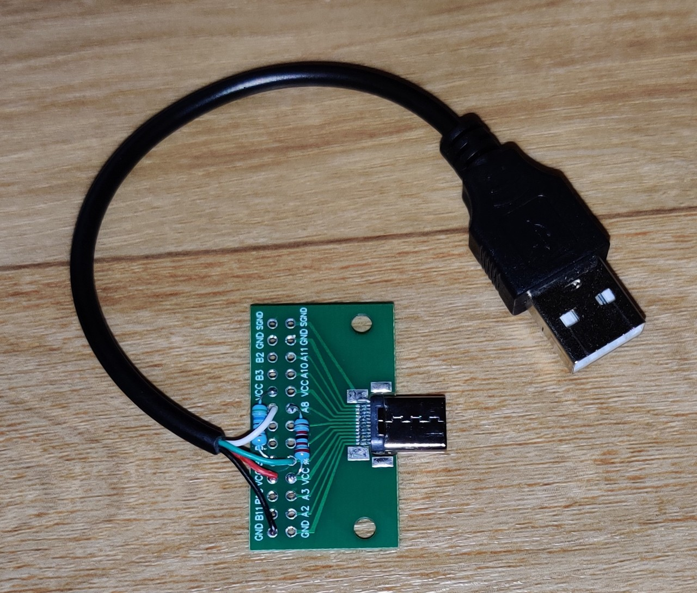
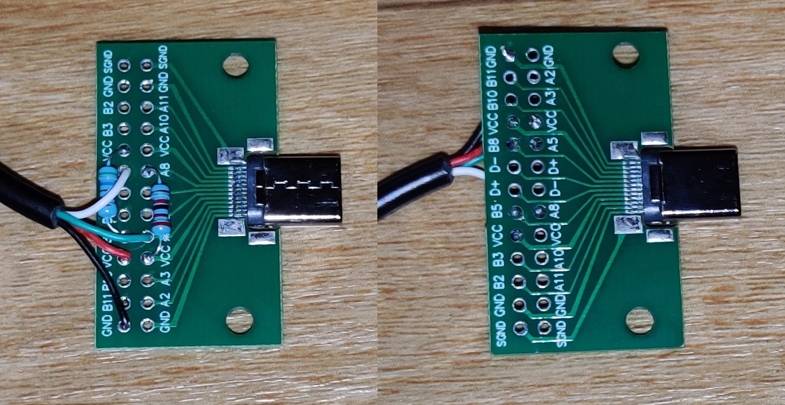
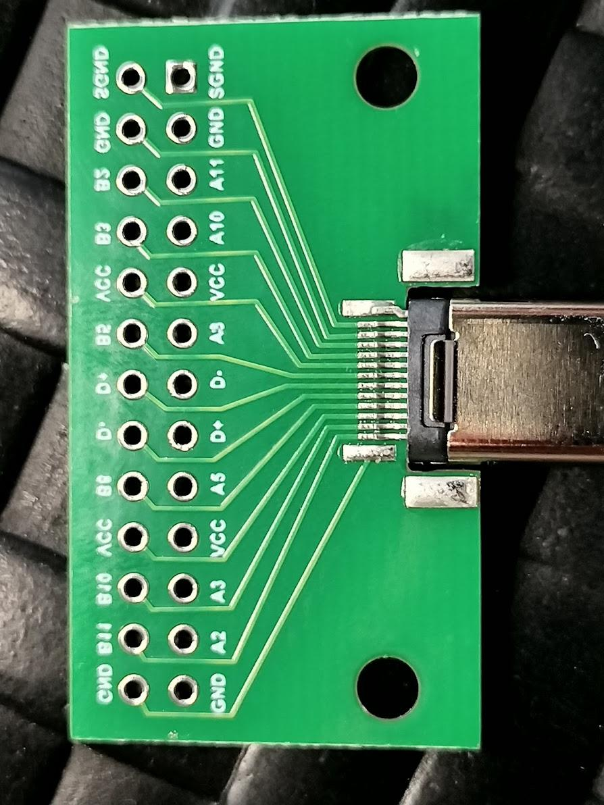
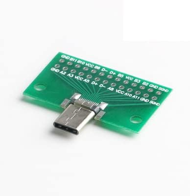

# Chromebook

## SuzyQable

Stack ExchangeにSuzyQableを自作しようとしたが、
うまくいかない、という質問が挙がっている。

[usb - DIY Chromebook debug cable (SuzyQable / Suzy Q Cable) - Electrical Engineering Stack Exchange](https://electronics.stackexchange.com/questions/629357/diy-chromebook-debug-cable-suzyqable-suzy-q-cable)



以下はそれに対する回答である。

 Answer

I found the problem, this breakout board is available as 'Male' and 'Female' version, the pcb silkscreen is intended for the socket version (female) so the plug version (male) is basically reversed.



The correct pinout for this specific breakout board is:

```
A5: D+
B5: D-
A8: 22K resistor to VCC
B8: 56K resistor to VCC
```

A fully working cable only needs the two resistors and the USB plug cable, additional joints for VCC/GND are not needed (at least on my device).




Share
Cite
Follow
edited Jul 30, 2022 at 21:34
answered Jul 30, 2022 at 21:29
chrome's user avatar
chrome
10111 silver badge66 bronze badges

## 配線

どうやらUSB Type-Cコネクタの基盤に印字された
端子名が間違っているらしい。
A5↔A8、B5↔B8が入れ替わっているようだ。
これはAmazonの当該商品における評価にも、
そのように記述されている（後述）。



[上段]
|端子|接続|-| 
|-|-|-|
|SGND|-|-|
|GND|-|-|
|B2|-|-|
|B3|-|-|
|VCC|56KΩ|-|
|B5|白|-|
|D+|-|-|
|D-|-|-|
|B8|56KΩ|-|
|VCC|赤|-|
|B10|-|-|
|B11|-|-|
|GND|黒|-|

[下段]
|端子|接続|-|
|-|-|-|
|SGND|-|-|
|GND|-|-|
|A11|-|-|
|A10|-|-|
|VCC||-|
|A8|22KΩ|-|
|D-|-|-|
|D+|-|-|
|A5|緑|-|
|VCC|22KΩ|-|
|A3|-|-|
|A2|-|-|
|GND|-|-|

## USB Type-C コネクタ

[Amazon.co.jp: Moechando CタイプUSBコネクタ Type-C 24P コネクタ DIY 実装済みUSBモジュール オス・メス （入荷予定あり）（オス） : パソコン・周辺機器](https://www.amazon.co.jp/gp/product/B08Y92L7R5/ref=ppx_yo_dt_b_asin_title_o01_s00?ie=UTF8&th=1)



### Amazonでの評価

5つ星のうち4.0 

オス側は基板上の表記が変？

2022年1月29日に日本でレビュー済み

スタイル: オスAmazonで購入
USB Type-C のケーブルや延長コネクタの結線を確認するために、オス・メスセットで購入しました。
早速、とあるデバイスのCCとVCON（A5,B5ピン）の結線を確認すると、何かおかしい．．．．
どうもA8とB8に結線されているように見えます。

で、購入したオス・メス両方のモジュール同士を直接繋いで確認すると、次のように繋がって見えます。

```
オス側　　メス側
　A5 －－－ B8
　A8 －－－ B5
　B5 －－－ A8
　B8 －－－ A5
```

そこで、メス側のモジュールをサンハヤトの「コネクター変換基板 USB Type-C メス CK-44」に替えてみたところ、やはり同じ結果となりました。
このサンハヤトの変換基板は、これまでに何度も色々な検証実績があり信頼出来る製品です。またメス側は２つとも同じ結果だったことから、おそらく今回購入したオス側のモジュールの表記がおかしいと思われます。
具体的には、上下（A側とB側）が逆になっているようです。

そういうものだと理解して使えば、何の問題も無いので、このまま使い続けようと思います。
というか、24ピン全結線のUSB-Cオスのテストボード、他に見つけられないので．．．．．

## ファームウェアの置換
[Developer Information for ChromeOS Devices](https://www.chromium.org/chromium-os/developer-library/reference/development/developer-information-for-chrome-os-devices/)

```
Release: 2023-03-31
OEM: Lenovo
Model: Lenovo IdeaPad Flex 3i Chromebook
Code name: Pujjoflex
Board name: Nissa
Base board: Nissa
User ABI: x86_64
Kernel: 5.15
Kernel ABI: x86_64
Platform: AlderLake-N
Form factor: Convertible
USB Gadget: Yes
Closed Case Debugging: Yes　<-　SuzyQableによる書き込み保護解除が可能
Supported Devices
MrChromebox.tech
```

```
DeviceName: Lenovo IdeaPad Flex 3i Chromebook
Board Name: PUJJOFLEX	
RW_LEGACY( AltFw / edk2 ): ✅
Full ROM( UEFI / edk2 ): ✅	
WP Method: CR50 <- SuzyQableによる書き込み保護解除が可能
```
