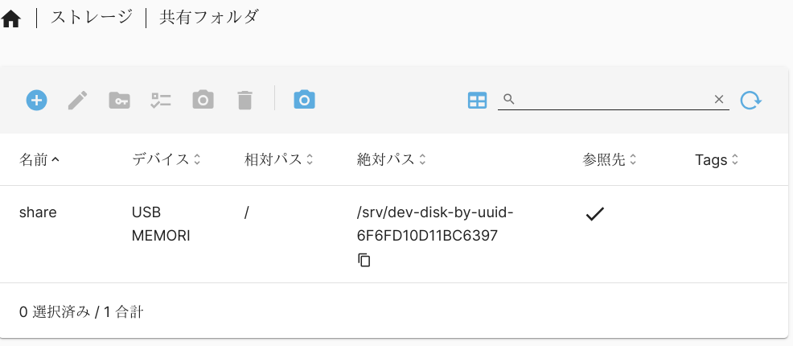

# Open Media Vault

## インストール

### BIOS設定

`Secure boot`を`Disable`にする。

### ソフトウェアソース

`ftp.jaist.ac.jp`はうまく行かない。
`ftp.jp.debian.org`を選択する。


### 起動後の設定

`root`でログインし、`omv_firstaid`コマンドで
`1 Configure Network Interface`を選択して、
ネットワークの再設定を行う。

共有フォルダのマウント場所は毎回変わるのか？→**変わらない**



## qBittorrent

aptでインストールする。
```
sudo apt install qbittorrent-nox
```

`qbtuser`を作成する。
```
sudo adduser qbtuser
```
`qbtuser`でWebUIを起動する。

```
sudo su qbtuser
qbittorrent-nox -webui-port=8000
```
(ポートを指定しないと8080で起動し、
ブラウザでアクセスしたときに`Page Not Found`となる)

ブラウザで`http://HOST:8000`にアクセスして
qBttorrentの設定を変更する。
```
IPアドレス:	* ポート: 8000

ホワイトリストに登録されたIPサブネットのクライアントは認証を行わない
192.168.0.0/16
```

手動でのサービス開始

```
sudo systemctl start qbittorrent-nox@qbtuser
```

起動時にサービスが開始されるようにする。

```
sudo systemctl enable qbittorrent-nox@qbtuser
```

ダウンロード先の設定は共有フォルダの
絶対パスをコピーして


qBittorrentの「オプション→ダウンロード→保存管理→デフォルトの保存パス」
に貼り付け、末尾に「/Downloads」を追加する。


```
/srv/dev-disk-by-uuid-6F6FD10D11BC6397/Downloads
```


# シャットダウン

シャットダウンはWebインタフェース画面右上の電源アイコンをクリック。
あるいはrootでログインして

```
shutdown -h now
```