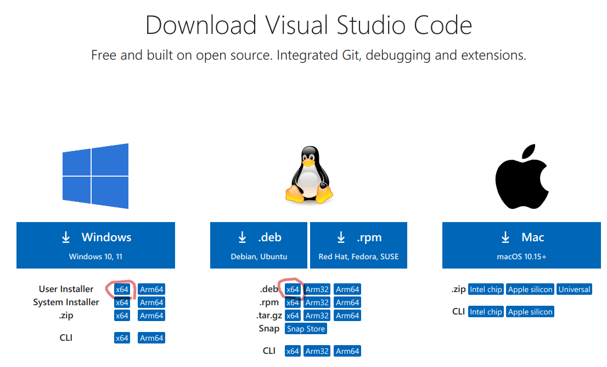

# VSCode

## インストール



## Vimのインサートモードから抜けるときIMEをオフにする

[Windows]
```
"vim.autoSwitchInputMethod.enable": true,
"vim.autoSwitchInputMethod.defaultIM": "0",
"vim.autoSwitchInputMethod.obtainIMCmd": "C:\\Users\\saka1\\git\\util\\bin\\zenhan.exe",
"vim.autoSwitchInputMethod.switchIMCmd": "C:\\Users\\saka1\\git\\util\\bin\\zenhan.exe {im}",
```
以下のようにするとIME状態を引き継がない。
```
"vim.autoSwitchInputMethod.enable": true,
"vim.autoSwitchInputMethod.defaultIM": "0",
"vim.autoSwitchInputMethod.obtainIMCmd": "C:\\Users\\saka1\\git\\util\\bin\\zenhan.exe {im}",
"vim.autoSwitchInputMethod.switchIMCmd": "C:\\Users\\saka1\\git\\util\\bin\\zenhan.exe {im}",
```
`zenhan.exe`は`~/git/util/bin`の下にある。

[Linux(fcitx)]
```
"vim.autoSwitchInputMethod.enable": true,
"vim.autoSwitchInputMethod.defaultIM": "1",
"vim.autoSwitchInputMethod.obtainIMCmd": "/usr/bin/fcitx-remote",
"vim.autoSwitchInputMethod.switchIMCmd": "/usr/bin/fcitx-remote -t {im}",
```
以下のようにするとIME状態を引き継がない。
```
"vim.autoSwitchInputMethod.enable": true,
"vim.autoSwitchInputMethod.defaultIM": "-c",
"vim.autoSwitchInputMethod.obtainIMCmd": "/usr/bin/fcitx-remote",
"vim.autoSwitchInputMethod.switchIMCmd": "/usr/bin/fcitx-remote {im}",
```
[Ubuntu(ibus)]
```
"vim.autoSwitchInputMethod.enable": true,
"vim.autoSwitchInputMethod.defaultIM": "xkb:us::eng",
"vim.autoSwitchInputMethod.obtainIMCmd": "/usr/bin/ibus engine",
"vim.autoSwitchInputMethod.switchIMCmd": "/usr/bin/ibus engine {im}",
```

上記の設定では再度インサートモードに入った時に、
前回のインサートモード時のIME状態を引き継ぐ。
Windowsの場合obtainIMCmdの値をswitchIMCmdと同じにすると、
再度インサートモードに入った時にIMEが常にオフの状態になる。
あるいは「zenhn.exe 0」


## markdown イメージ貼り付け

markdownテキスト内でクリップボードからイメージを貼り付けると、
イメージをファイルとして保存し、そのイメージへのリンクが追加される。

settings.jsonに以下を追加する。

```json
"markdown.copyFiles.destination": {
    "**/*": "${documentBaseName}/${fileName}"
},
```

markdownファイル名の拡張子(.md)を除いたディレクトリの下に
イメージが配置される。


```
docDirectory/
    +-- docName.md
    +-- docName/
        +-- image.png
        +-- image-1.png
        +-- image-2.png
```

markdownファイル内は以下のようになる。

```


```

テキスト中のリンクの記述を削除してもイメージは削除されないので注意する。
